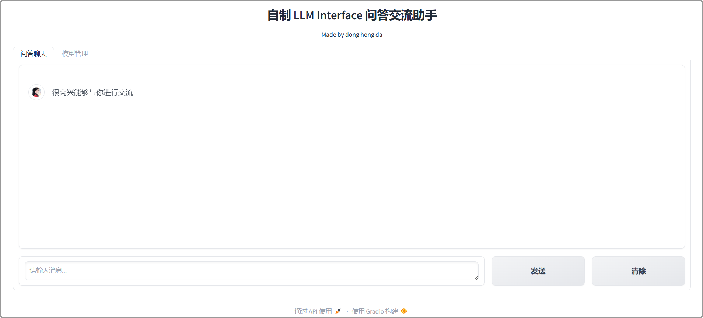
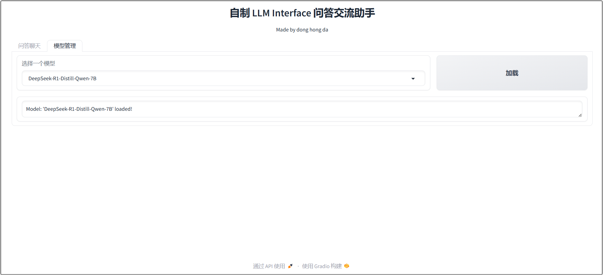

# Customized Text Generation Web UI

**A Gradio web UI for Large Language Models.**

## Interface



## Run

- **install packages**

```bash
pip install -r requirements.txt
```

- **prepare model** ( download from https://huggingface.co/ , multiple models can be placed )

```bash
text-generation-webui-customized
├── models
│   ├── Qwen2.5-7B-Instruct
│   │   ├── config.json
│   │   ├── generation_config.json
│   │   ├── model-00001-of-00004.safetensor
│   │   ├── model-00002-of-00004.safetensor
│   │   ├── model-00003-of-00004.safetensor
│   │   ├── model-00004-of-00004.safetensor
│   │   ├── model.safetensor.index.json
│   │   ├── merges.txt
│   │   ├── tokenizer_config.json
│   │   └── vocab.json
```

- **run server**

```bash
python webui.py
```

- **Enter the following in the browser**

```
http://localhost:7860
```

## Reference

- https://qwen.readthedocs.io/zh-cn/latest/inference/chat.html
- https://github.com/oobabooga/text-generation-webui
- https://blog.csdn.net/qq_22876439/article/details/140895257
- https://blog.csdn.net/qq_51116518/article/details/142654447


